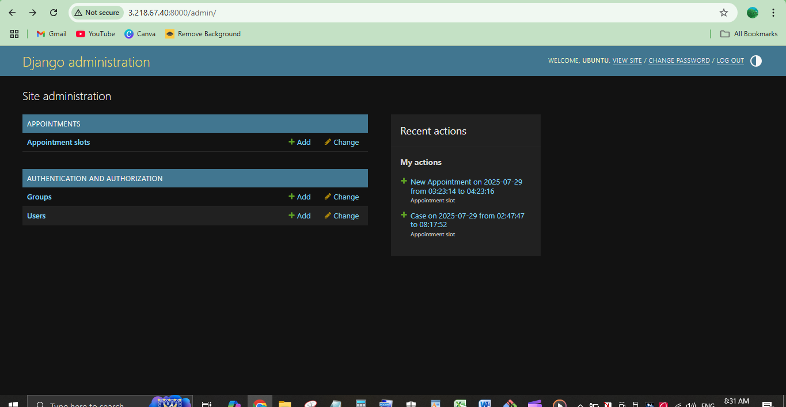

📽️ [Watch Demo Video on YouTube](https://youtu.be/5DbEkGG0Xwg?si=RFh49lIUL4EFsbHM)

# Hosted-Full-Stack-Appointment-Booking-App--Django-AWS
This is a fully functional Appointment Booking App built with Django (Python) and deployed using AWS services like EC2 and RDS.
It allows professionals (like doctors, teachers, consultants, etc.) to:
•	Create available time slots
•	Let users book appointments
•	Manage bookings and data securely
The goal of this project was to take a real-world app, set it up on the cloud, and make it work just like a professional system would.
________________________________________
✅ What I Did (In Simple Steps)
1️⃣ Built the App with Django
I started by building the backend using Django, which handles:
•	Time slots
•	Booking system
•	Admin management
•	Database models
Everything was tested locally first to make sure the logic and database are working correctly.
________________________________________
2️⃣ Set Up AWS EC2 (Virtual Machine)
I launched an EC2 instance (Amazon’s cloud computer) to host the project.
•	Installed Linux, Python, pip, PostgreSQL client, Git
•	Uploaded the project code securely using SCP
•	Set up a virtual environment and installed all requirements
•	Ran the app using python manage.py runserver 0.0.0.0:8000
Now the app is live and can be accessed via the EC2 public IP.
________________________________________
3️⃣ Connected to RDS (Cloud Database)
Instead of using a local database, I used Amazon RDS to store booking data securely.
•	Created a PostgreSQL DB instance on RDS
•	Connected the Django app to this DB using credentials and endpoint
•	Now all appointments, time slots, and data are saved directly to RDS
________________________________________
4️⃣ Deployed and Tested Everything Live
Once the code and DB were connected:
•	I created a time slot using the Django admin panel
•	Then, I tested booking that slot from the frontend/API
•	Finally, I checked that the data was saved in RDS — success! ✅
________________________________________
🎯 What This Project Proves
This is not just a coding project — it's a complete cloud deployment case study that shows I can:
•	Build real backend systems
•	Deploy apps securely on EC2
•	Set up and connect cloud databases (RDS)
•	Work with environments, dependencies, SSH, and server management
•	Ensure real-time data flows between frontend, backend, and cloud DB
________________________________________
💡 Use Cases
This setup can be used for:
•	Appointment apps (doctors, tutors, coaches)
•	Booking systems (classes, meetings, events)
•	Any service-based platform that needs time slot booking
________________________________________
📸 Screenshots and Video:
You can find a full walkthrough video of this project in action here in this repo and screenshots in the /Screenshots folder.

🙋♂️ Want This For Your Business?
If you need:
•	A custom booking system
•	A backend app deployed on AWS
•	Help migrating your app to cloud
I can help set it up exactly the way you need — securely, professionally, and affordably.

